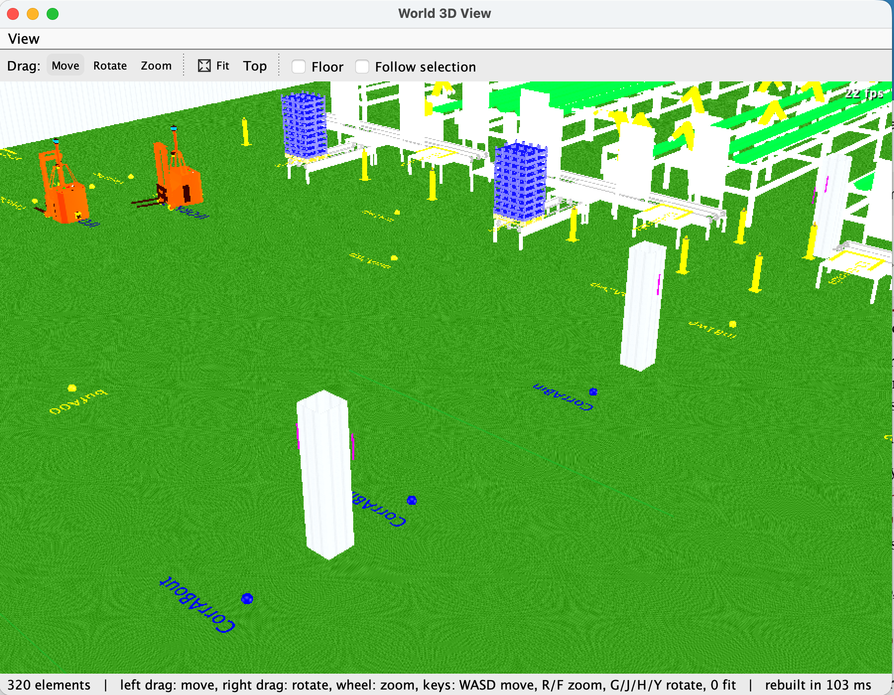
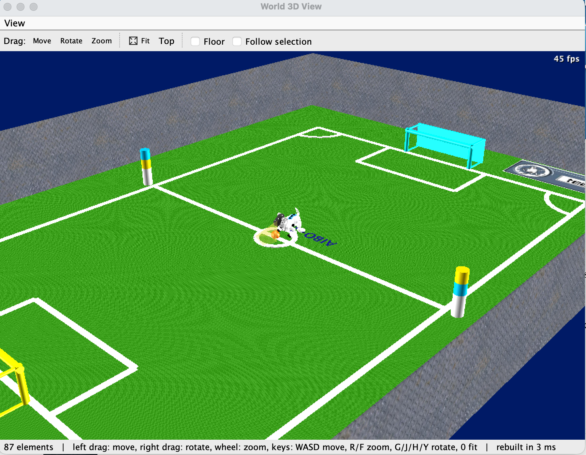
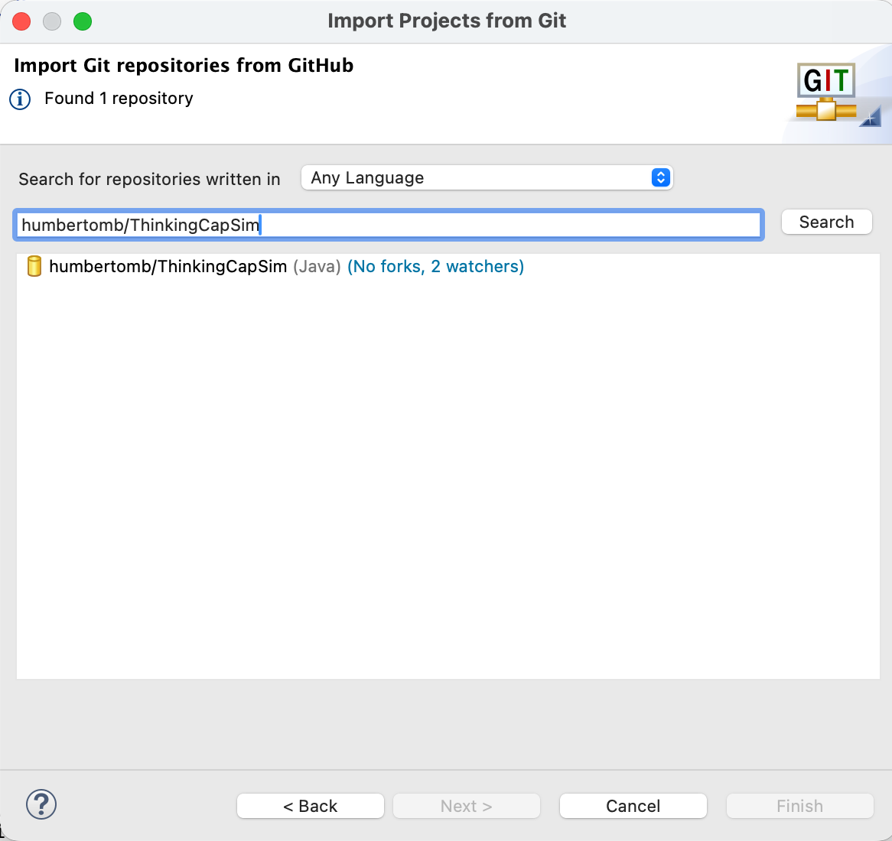

# **ThinkingCapSim**

Robots simulator written entirely in Java. It is based on the ThinkingCap functional architecture, and the ThinkingCap2 software architecture. The repository root is a Java Eclipse project for **Java 25**. Different launch configurations are included. 

  

## **Requirements**

* A **JDK 25** (for example [Eclipse Temurin](https://adoptium.net/)). The project is compiled with Java 25 compliance and expects a `JavaSE-25` execution environment.
* **Eclipse IDE for Java Developers**, a release that supports Java 25. In *Settings → Java → Installed JREs* add the JDK 25 and make sure it is the one matched to `JavaSE-25` (*Installed JREs → Execution Environments*).
* Nothing else to install: all the libraries (Java 3D, JOGL with its native libraries for macOS, Linux and Windows, JFreeChart, Gson...) are in `jarlibs`.

## **Installation**

Clone the repository and import it into Eclipse as an existing project (File –> Import –> Existing Projects into Workspace), or import it directly from Git:

* Copy the GitHub URL of the repository to the clipboard.
*	Open Eclipse and choose Import –> Projects from Git -> GitHub
*	Choose the project in the Git import wizard (humbertomb/ThinkingCapSim) and click Next.
*	Confirm the URI, Host, and Repository path parameters and click Next.

For this project use the following URL:
```
https://github.com/humbertomb/ThinkingCapSim.git
```




The project must keep the name **ThinkingCapSim** in the workspace: the launch configurations refer to it by that name.

## **Running**

Run the launch configurations from *Run → Run Configurations... → Java Application*:

* `TCS_Simulator`: the simulator. Load a deployment with *File → Load Deployment...* (the examples are in `conf/deploy`), then *Execution → Execute* (F5) and *Start* (F7).
* `TCS_Robot_Editor`: the editor of robots (`conf/robots`).
* `TCS_World_Editor`: the editor of worlds (`conf/maps`).
* `TCS_Deployment_Editor`: the editor of deployment architectures (`conf/deploy`).

They run from the project folder (the paths of the configuration files are relative to it) and already carry the arguments the Java 3D views need on Java 25 (`--add-opens java.desktop/sun.awt=ALL-UNNAMED --enable-native-access=ALL-UNNAMED`). To launch any other class, give it the same VM arguments.
